<a id="top"></a>

<div align="center">
  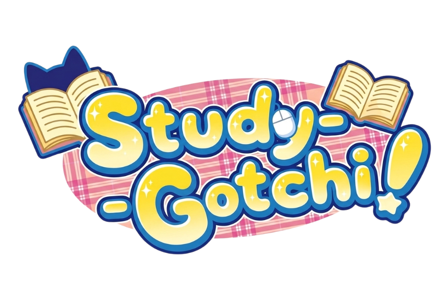

  <h1>StudyGotchi</h1>

  <p>
    <strong>StudyGotchi helps students finish tasks by turning study sessions into care, rewards, reminders, and evolution for a tiny desktop pet.</strong>
  </p>

  <p>
    <a href="#instructions-on-how-to-run-the-application"></a>
    <a href="#quality"></a>
    <a href="LICENSE"></a>
    <a href="VERSION"></a>
  </p>

  <p>
    <a href="#demo">Demo</a> .
    <a href="#instructions-on-how-to-run-the-application">Run</a> .
    <a href="#features-and-functionalities-of-the-system">Features</a> .
    <a href="#uml-diagram">UML</a> .
    <a href="#names-of-the-developers-or-team-members">Team</a> .
    <a href="#quality">Quality</a>
  </p>
</div>

---

<div align="center">
  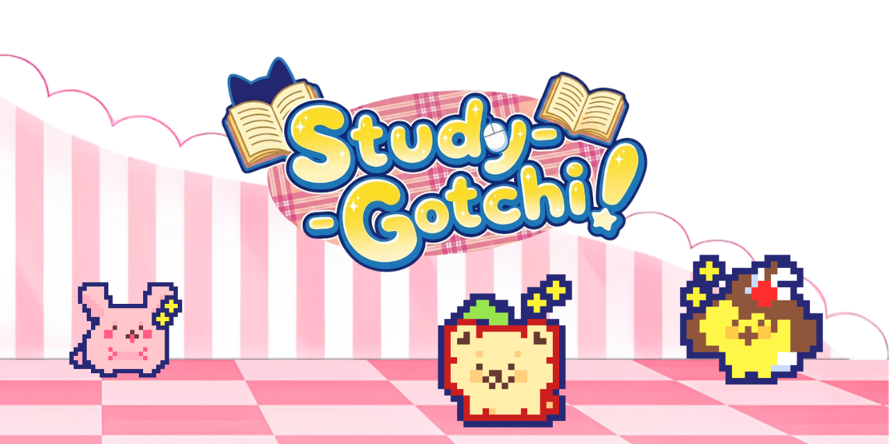
</div>

## Demo

<div align="center">
  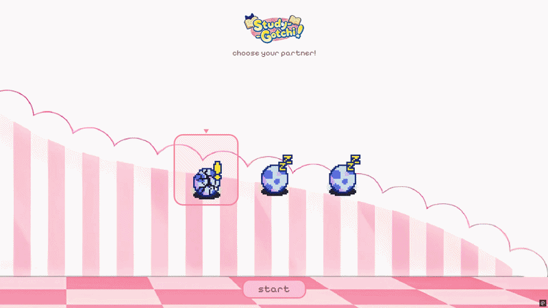
</div>

| Dashboard | Pet Selection | Floating Widget |
| --- | --- | --- |
| 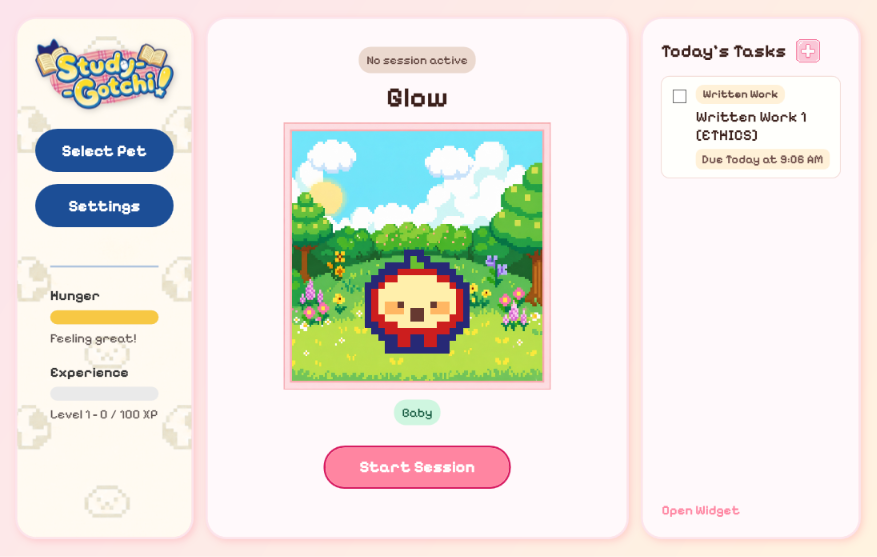 | 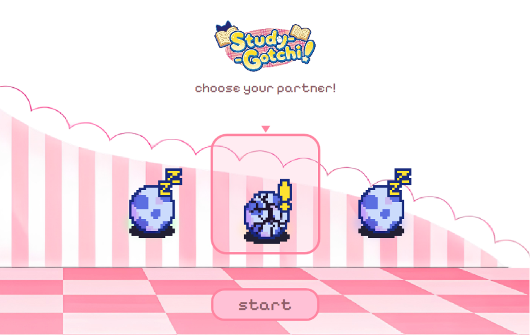 | 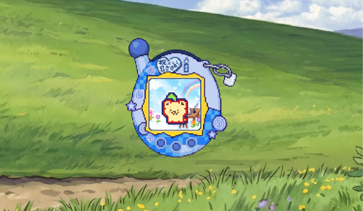 |

| Add Task | Session Summary | Settings |
| --- | --- | --- |
| 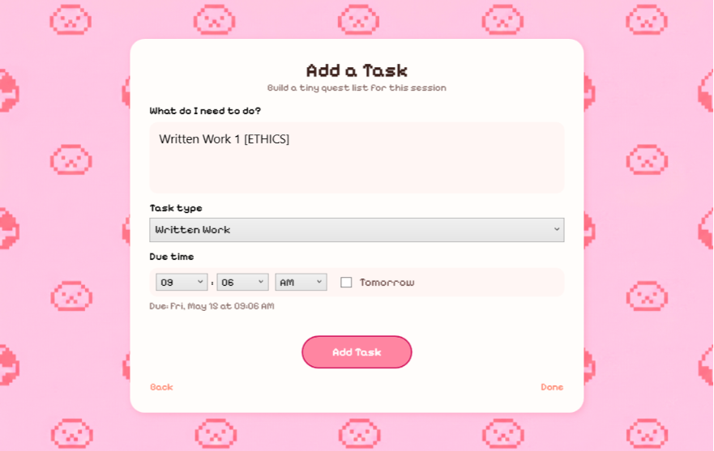 | 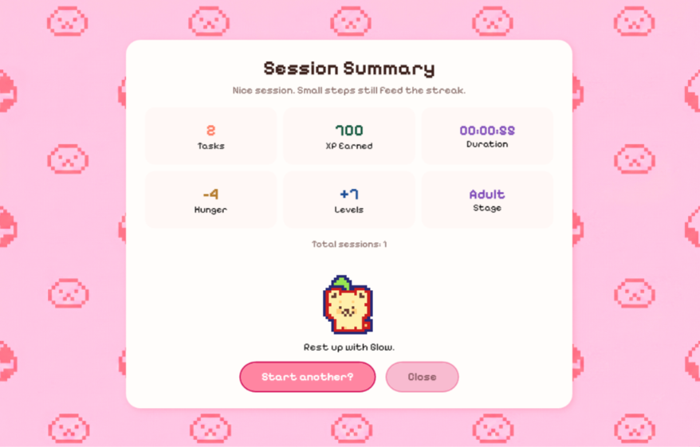 | 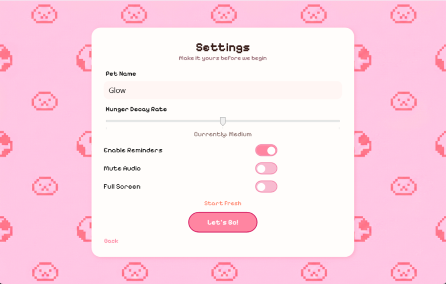 |

## Instructions on How to Run the Application

### Requirements

- Windows 10 or later
- [.NET 10 SDK](https://dotnet.microsoft.com/download)
- Git
- Visual Studio 2022 with the `.NET desktop development` workload, if you prefer running the app from the IDE

### Install From Source

```bash
git clone https://github.com/owendenied/study-gotchi.git
cd study-gotchi
dotnet restore StudyGotchi/StudyGotchi.slnx
dotnet build StudyGotchi/StudyGotchi.csproj
```

### Run From Visual Studio

1. Open `StudyGotchi/StudyGotchi.slnx`.
2. Restore NuGet packages when prompted.
3. Set `StudyGotchi` as the startup project.
4. Press `F5`.

## Quick Start

Copy and run this from a terminal:

```bash
git clone https://github.com/owendenied/study-gotchi.git
cd study-gotchi
dotnet restore StudyGotchi/StudyGotchi.slnx
dotnet run --project StudyGotchi/StudyGotchi.csproj
```

Once the app opens:

1. Choose a pet.
2. Name your pet and adjust settings.
3. Add one study task with a deadline.
4. Start a session.
5. Complete the task to feed your pet, earn XP, and progress toward evolution.

## Project Description and Purpose

StudyGotchi turns a study session into a small care ritual. Your task list becomes a set of quests, your deadlines become gentle reminders, and your progress keeps a virtual pet healthy and growing. Completing work rewards the pet with XP and hunger recovery; missing deadlines or studying too long without care makes the pet need attention.

The app is designed for students who want task tracking to feel warm, visual, and motivating without becoming noisy. It keeps the experience focused: plan work, start the timer, keep your pet nearby, finish tasks, and review the session summary.

## UML Diagram

The diagram below reflects the current app wiring, including the shared service registry, controllers, view models, and the model layer that keeps the pet and tasks in sync.

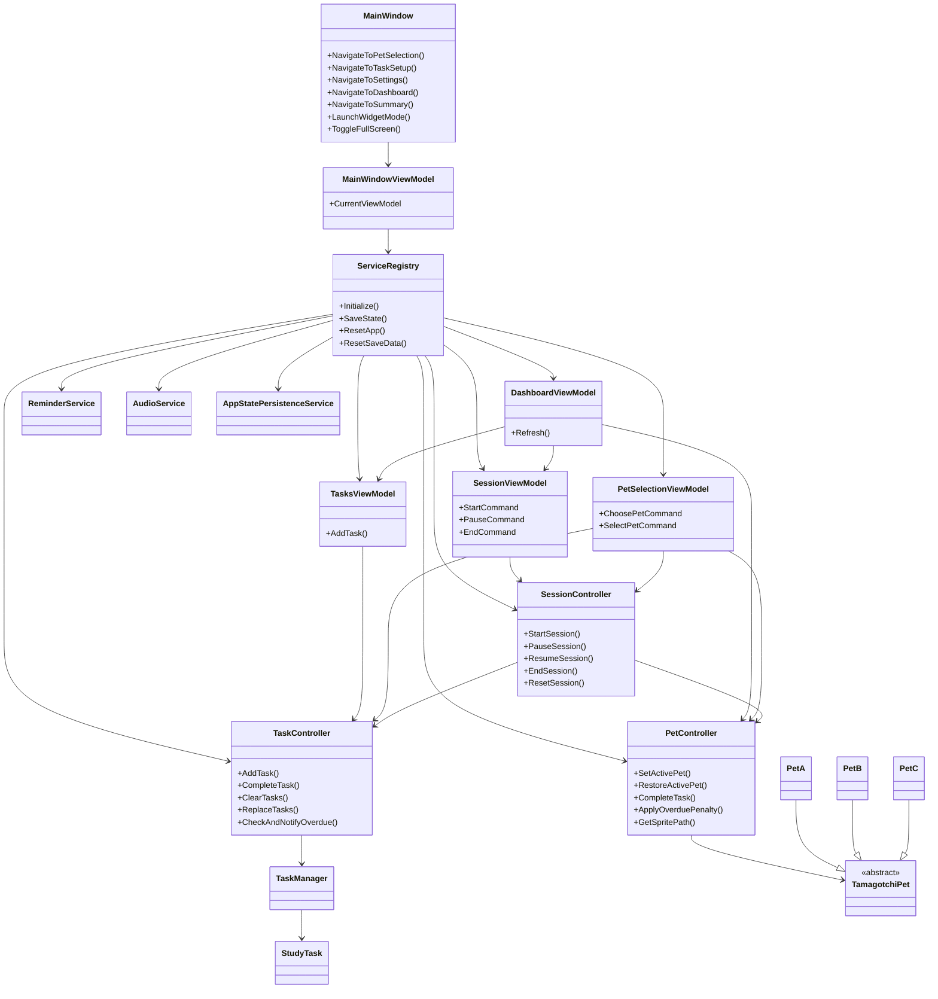

## Features and Functionalities of the System

| Area | What It Does |
| --- | --- |
| Study sessions | Start, pause, resume, reset, and end timed focus sessions. |
| Task planning | Add study tasks with names, categories, and deadlines. |
| Task rewards | Completing tasks grants XP and restores hunger; early completion doubles XP. |
| Pet care | Hunger decays during sessions, overdue tasks reduce hunger, and low hunger reduces XP gain. |
| Progression | Pets level from 1 to 30 and evolve through Baby, Teen, and Adult stages. |
| Pet selection | Choose from three pet families with separate sprites and mood states. |
| Reminders | Deadline reminders fire at 10, 5, and 1 minute before a task is due. |
| Floating widget | Keep an always-on-top pet companion visible while working in other apps. |
| Audio feedback | Background music and event sounds support session starts, reminders, completion, and level-ups. |
| Persistence | Saves pet, tasks, settings, stats, and active session state locally. |
| Recovery | Backs up corrupted save files and starts cleanly instead of crashing. |

## Explanation of How the Program Works

StudyGotchi begins with pet selection. Once a pet is chosen, the app stores that choice, loads the current save state, and moves into the dashboard. From there, the player adds study tasks, starts a focus session, and keeps working while the pet's hunger, XP, and evolution state update in the background.

The session controller tracks elapsed time, task completions, pause and resume state, and the summary data that appears at the end of a run. The task controller manages study tasks and overdue checks, while the pet controller handles hunger, XP, evolution, and sprite selection. Reminder, audio, and persistence services keep the experience responsive, cozy, and safely saved locally.

The floating widget gives the pet a smaller home on the screen, and the session summary gives a tidy recap once the study block is done. It is meant to feel like a gentle loop: choose a pet, plan the work, focus, finish, and watch the pet grow with you.

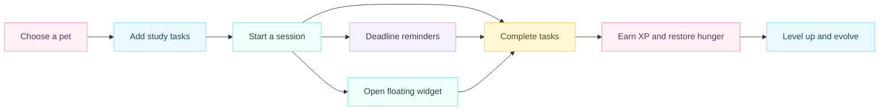

## Tech Stack

| Layer | Technology |
| --- | --- |
| App | C# desktop application |
| Runtime | .NET 10 |
| UI | WPF |
| Animation | WpfAnimatedGif |
| Persistence | Local JSON in `%APPDATA%\StudyGotchi\state.json` |
| Testing | xUnit |
| Assets | Pixel sprites, PNG backgrounds, Pixelify Sans fonts, WAV/MP3 audio |

## Architecture

StudyGotchi keeps the codebase split into clear responsibilities: screens render the interface, view models expose bindable state, controllers coordinate user actions, models own the pet/task rules, and services handle persistence, audio, reminders, and shared app wiring.

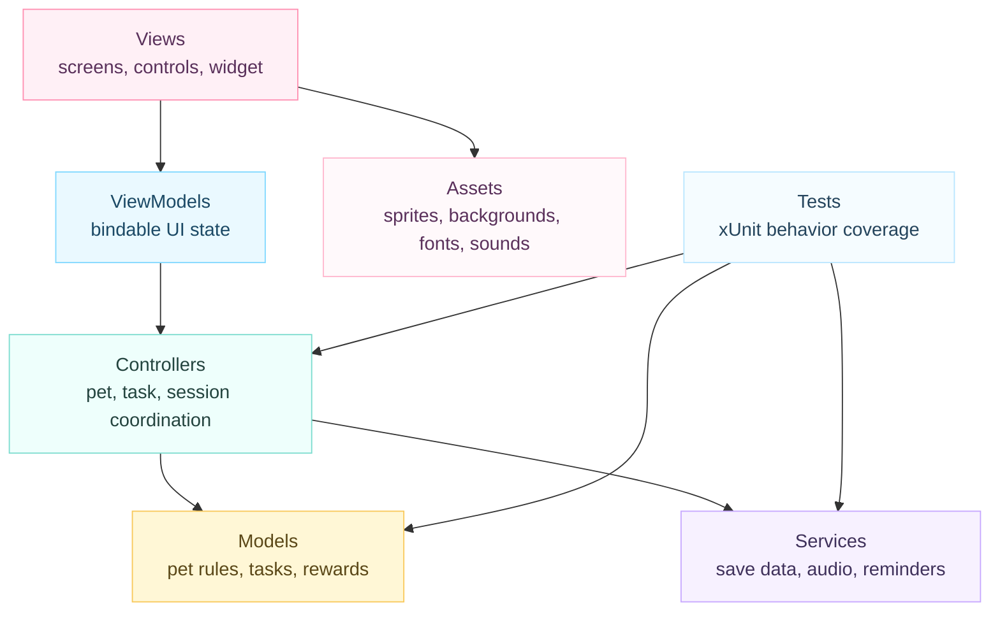

## Project Structure

```text
study-gotchi/
|-- StudyGotchi/                 Desktop app
|   |-- Assets/                   Pixel backgrounds, pet sprites, fonts, and audio
|   |-- Controllers/              Session, task, and pet coordination
|   |-- Converters/               WPF value converters
|   |-- Interfaces/               Pet and task observer contracts
|   |-- Models/                   Core task and pet rules
|   |-- Services/                 Persistence, reminders, audio, and service registry
|   |-- Styles/                   Global WPF resources and button styles
|   |-- ViewModels/               Bindable state for screens and controls
|   `-- Views/                    Windows and user controls
|-- StudyGotchi.Tests/           xUnit tests
|-- README.md
`-- .gitignore
```

## Quality

Run the test suite:

```bash
dotnet test StudyGotchi.Tests/StudyGotchi.Tests.csproj
```

Run a full local verification pass:

```bash
dotnet restore StudyGotchi/StudyGotchi.slnx
dotnet build StudyGotchi/StudyGotchi.csproj --no-restore
dotnet test StudyGotchi.Tests/StudyGotchi.Tests.csproj --no-restore
```

The tests cover task rewards, early-completion bonuses, hunger penalties, session state, reminders, corrupted-save recovery, persisted stats, input normalization, and pet sprite selection.

## Names of the Developers or Team Members

- Eume C. Derez - GUI Designer and Artist
- Coleen B. Dichoso - Logic Developer
- Goldwyn Daine Kierzene D. Mendoza - Project Manager

## Contributing

Contributions are welcome! Whether it is a bug fix, a new pet sprite, or a quality-of-life tweak, if it fits the cozy study loop, it belongs here.

1. Branch from `main` and keep changes focused.
2. Match the pastel pixel style for any UI changes.
3. Add or update tests for anything touching tasks, sessions, pets, reminders, or persistence.
4. Run the build-and-test commands before opening a pull request.
5. Include screenshots for visual changes.

## License

StudyGotchi is released under the [MIT License](LICENSE).

<div align="center">
  <sub>Made for focused study sessions, tiny wins, and one very cared-for desktop pet.</sub>
  <br />
  <a href="#top">Back to top</a>
</div>
